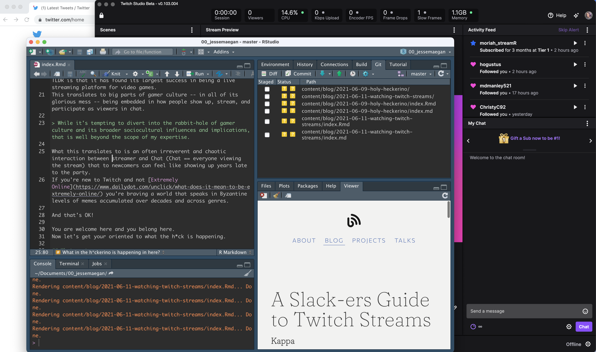
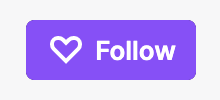
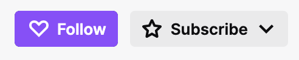
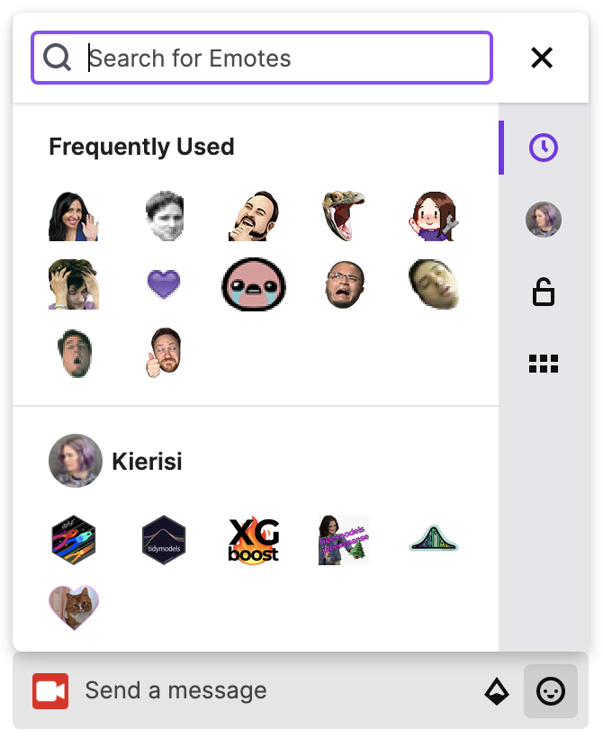
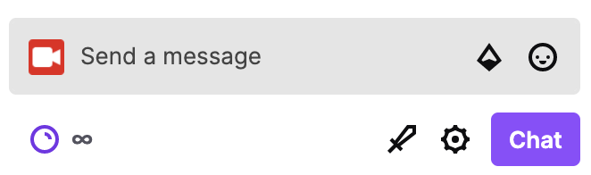
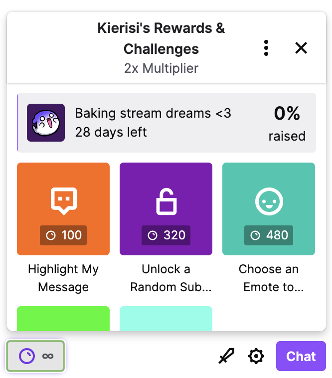

## This got long so here's a Table of Contents

* **[What in the h*ckerino is happening in here?]()**
* **[What a streamer sees]()**
* **[Supporting a streamer and their content]()**, with info on Follows, Subscriptions, and Bits, as well as Affliates, Partners, and Stream Teams
* **[Please what is Chat and how does it work?]()**, with information on being a decent human, Chat vs. chat, emotes, Channel Points, and lurking
* **[Fake it 'til you make it: using chat as the gamers intended]()**
* **Contribute to building a Community]()**, with info on Raids and Clipping & Sharing 

## What in the h*ckerino is happening in here?
Landing yourself in Twitch can be an, uh, _experience_. 
This guide is written as a primer for those of us who feel pretty cool when we upload a new Slack emoji, but feel a little _lost_ when we tune in to a Twitch stream.

Online spaces each of their own culture and way of operating, and Twitch is no different.
Twitch has an [interesting history](https://en.wikipedia.org/wiki/Twitch_(service)), but the TLDR is that it has found its largest success in being a live streaming platform for video games. 
This translates to big parts of gamer culture -- in all of its glorious mess -- being embedded in how people show up, stream, and participate as viewers in chat.

> While it's tempting to divert into the rabbit-hole of gamer culture and its broader sociocultural influences and implications, that is well beyond the scope of my expertise. I _do_ encourage you to look into this topic on your own though. It's complicated and messy and well worth some thought and investigation.

What this translates to is an often irreverent and chaotic interaction between streamer and Chat (everyone viewing the stream) that to newcomers can feel like showing up years late to the party. 
If you're new to Twitch and not [Extremely Online](https://www.dailydot.com/unclick/what-does-it-mean-to-be-extremely-online/) you're braving a world that speaks in Byzantine levels of memes accumulated over decades and across genres. 

And that's OK!
You are welcome here and you belong here. 
Now let's get your oriented to what the h*ck is happening.

## What a streamer sees
Let's start by narrowing the scope of things down to data science and machine learning streams on Twitch because let's be real, that's what most of you reading this post are interested in. 
(Here's a link to [all of the current data science and machine learning streamers I'm aware of](https://www.jessemaegan.com/blog/2021-05-28-data-science-twitch-streamers-round-up/) -- please feel free to [open an issue or file a PR](https://github.com/kierisi/jessemaegan) to add more!)

When I go live and start streaming to the world, it's not as simple as "oh yes let me turn on my camera and talk about what I'm doing and it's all systems go!" 
As a small-time streamer I'm _also_ focused on:

* Creating some kind of entertainment value (honestly this just might be me and my love of performance)
* Keeping track of follows and subscriptions so that I can shout folks out and thank them during the stream
* Watching chat so that I can interact by answering questions, participating in the conversation, and also bringing down the ban hammer on anyone acting out of line with my community guidelines
* Monitoring resource usage: if you've been to my streams you know that my internet cuts out -- often the first sign of this happening is an increase in dropped frames
* Updating community member privileges on the fly
* Dealing with my unruly bots
* Teaching folks who are new to Twitch how some things in Chat work,like Channel Points or `!commands`

Here's quick view of what I see during a coding stream:

## Supporting a streamer and their content
Streaming is a great way to start building out a personal brand and grow a community by sharing things that you're excited about. 

> YES I have thoughts on personal branding and YES there's a blog post coming _I promise_

Twitch is set up such that there are certain achievements that streamers have to hit in order to unlock different features and privileges that can range from having more features to being able to monetize a stream. 

Monetizing a stream comes means that a streamer can generate revenue from their streams. 
Revenue generation happens through various channels, including ads, bits, and subscriptions.
But in order to monetize your stream, you first have to become a **[Twitch Affiliate](https://affiliate.twitch.tv/)**.

### Twitch Affliliates
Do you like someone's stream?
Then you want to help them unlock this as fast as possible. 
The best way to do that is:

* Follow the streamer
* Watch the streams
* Share the stream on social media and encourage others to follow and watch the stream

You can **follow** a streamer by creating a Twitch account and clicking on the purple follow button, which looks like this:

 
Once a streamer has hit **Affiliate** status they can also start accepting **[subscriptions](https://www.twitch.tv/subs)** and **[bits](https://www.twitch.tv/bits)**.

**Subscriptions**   
I'm not going to lie, my heart gets a little butterfly-y every time I see a **[subscription](https://www.twitch.tv/subs)** come through. 
Because all of my content on Twitch is free and will always be free, subscriptions are never required. 
All the same, they're a really heartwarming way for someone to say "hey, I like your content and I want to buy you a coffee each month as a way to say thanks!" 

You can purchase a monthly subscription to a stream directly, or if you have Amazon Prime then you get one free subscription each month that you can use at no extra charge. 
What's more, if you'd like to **[gift a subscription](https://help.twitch.tv/s/article/gift-subscriptions?language=en_US)** (or bundle of subscriptions!) to stream followers, you can do that too! 

**Bits**   
**[Bits](https://www.twitch.tv/bits)** are a type of digital currency on Twitch. 
You can purchase bits for your account and then use them to "cheer" in chat during a stream. 
The streamer then gets some revenue from the bits that you used to cheer.

As a streamer continues to grow, they can eventually reach **[Partner status](https://www.twitch.tv/p/partners/)** and start doing some _really_ cool things, like creating a **[Stream Team](https://help.twitch.tv/s/article/twitch-teams?language=en_US)**.
Yes, obviously I want us to get to a point where there's a data science and machine learning stream team on Twitch! 

If you want that too then the best thing you can do is to watch streams. 
The hardest part about making Partner with Twitch is pulling in an average of 75 viewers. 
Lots of us are _thiiiiiiis_ close though, and with a little more support we could get there in the next few months! 

## Please what is Chat and how does it work?
### Being a decent human
Joining a stream is kind of like going to a get-together at the streamer's house. 
You want to follow their rules and guidelines (which you can almost always find on the [streamer's About page](https://www.twitch.tv/kierisi/about)) and in general be the kind of person that gets invited back. 

It's always nice to say hello, which you can simply type into chat, or you can branch out a bit and find the appropriate [emote](https://www.twitch.tv/creatorcamp/en/learn-the-basics/emotes/) (I like HeyGuys).

While "hello!" is always nice, there's rarely a need to announce that you're leaving. 
It's always a little weird when someone hasn't been participating in chat pipes in simply to say they're going to bounce. 

Many streams use automated commands to answer common questions. 
You can find out what the commands are by typing `!commands` in the chat window. 

### Chat vs. chat
Have you ever watched a Twitch stream and heard the streamer say something like "OK Chat!"?
That means they're talking to you -- yes you! -- the viewer. 
Calling out to captial-C-Chat is a way for the streamer to refer directly to the community watching the stream, and is almost always a call for participation. 

We really like it when people participate.  

Now while Chat refers to the collective viewership on a stream, chat refers to the chat window where everyone is frantically typing and spamming emotes. 

### Twitch emotes
You wouldn't necessarily spam your work Slack group with a series of emotes, but in Twitch? 
(Almost) anything goes. 
Sending through a group of emotes at once is a way of expressing how strongly you feel about something, and some channels (coughminecough) even have hidden emote challenges! 

**[Emotes](https://www.twitch.tv/creatorcamp/en/learn-the-basics/emotes/)** are their own language on Twitch, and in addition to global emotes, you can unlock channel-specific emotes through subscriptions and bits, and use them in any streamer's channel.

You can check out which emotes are available to you by clicking on the smiley face next to the chat box. 
When you mouse-over an emote it will also tell you the text code you can use to access the emote. 

### Channel Points
Twitch **[Channel Points](https://help.twitch.tv/s/article/channel-points-guide?language=en_US)** can be customized, but out-of-the-box they appear as a small crystal ball in the bottom left of chat: 

You earn channel points by watching a stream, so the longer you watch a stream and the more often you show up, the more channel points you accrue. 
You can even earn bonus points during a stream for staying on the same channel, and this will show up as a little gift box next to the crystal ball.
Your total number of channel points for a channel will show up as a number and not the infinity symbol, unless you're looking at your own chat channel.

You can redeem channel points for anything that the streamer has set. 
Here's a screenshot of some of the channel options I have, which includes a [Community Challenge](https://help.twitch.tv/s/article/community-challenges?language=en_US) that we are, uh, not making a lot of progress on yet because I maybe didn't realize I set the points to 1,000,000 instead of 100,000:

### Lurking vs participating
I love my lurkers.
Lurkers are people who turn on the stream but aren't engaging in chat. 
Lurkers might be watching the stream, or they simply could have the stream on and muted as a way to help support a streamer. 

> It's OK to be a lurker! 

I _wish_ I had time to watch all of the data science and machine learning streams that are happening right now, but that would take up at least 30 hours of my week. 
So what I try to do is tune in when I can, and at the very least have the stream on in the background so that our amazing community members are getting viewer counts and building their paths to **[Affiliate](https://affiliate.twitch.tv/)** and **[Partner](https://www.twitch.tv/p/partners/)**.

## Fake it 'til you make it: using chat like the gamers intended
As I mentioned above, the general rules for Twitch chat are to show up, say hi, and be an awesome human. 
Don't be afraid to use emotes -- they're there to be used! 

The general vibe to Twitch chat (and Chat) is that things are a little bit to a lot irreverent. 
Don't be rude or callous or cruel, but don't always take yourself so seriously. 

We've all been to professional talks and workshops where we've sat quietly and absorbed knowledge from a speaker or instructor. 
That's not quite how Twitch works. 

Instead think of Twitch as a slightly rowdy study group.
Yeah, you're there to get some work done, but you're also there to laugh, have fun, and build a sense of community.  

## Contribute to building a community
Our data science and machine learning community is growing by the day, and Twitch is just one of a multitude of ways for us to connect. 
We contribute to our community by showing up and supporting one another, and a couple of additional ways that you can help grow the community include participating in Raids and Clipping & Sharing.

### Raiding
**[Twitch Raids](https://help.twitch.tv/s/article/how-to-use-raids?language=en_US)** are initiated by the streamer, usually at the end of their stream. 
It's a way of taking your audience to another channel as a way of showing support for another streamer as well as introducing your audience to someone new. 

When the streamer you're watching initiates a Raid you'll see a pop-up in chat that gives you the option to leave, and you should exercise this option if you don't plan on sticking around to see 5--10 minutes of the new stream. 
But if you _do_ participate in the raid, all the same general rules apply: show up, say hi, and be an awesome human.

### Clipping and Sharing
Did something funny happen on stream?
Did the streamer say something that resonated with you and you want to share it with the world?

**[CLIP THAT ISH](https://help.twitch.tv/s/article/how-to-use-clips?language=en_US)**.**

Seriously.

When you create a clip from a stream it shows up in the [streamer's Video section](https://www.twitch.tv/kierisi/videos) on Twitch, and also creates a bite-sized piece of content that is _perfect_ for sharing. 

Personally I _love_ when people clip something I've said or done and share it with the world. 
It's a way of saying "here's why I think you should check this streamer out!" and it helps to grow our community in an authentic and engaging way.

** _Not all streamers allow clips. Be cool about it if your fave doesn't want clips._

