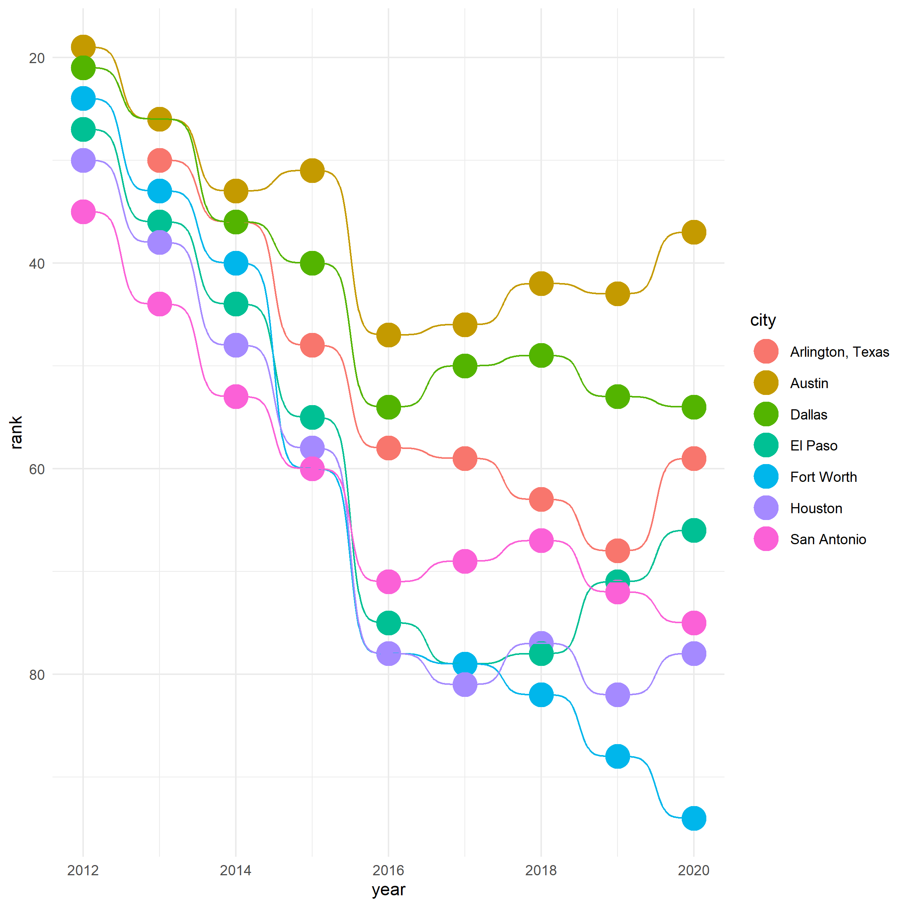

_If you're interested in a deeper dive into the dataset and exploring why this graph is not the most accurate representation, please read [this Twitter thread](https://twitter.com/RussellSPierce/status/1407770578212302859) from Dr. Russell S. Pierce._

I don't have any anecdotes or deep philosophical thoughts on life and how all of this connects back to creating a bump plot, so let's just dive right into things! 

<iframe width="560" height="315" src="https://www.youtube.com/embed/oUvQ1u0VNnk" title="YouTube video player" frameborder="0" allow="accelerometer; autoplay; clipboard-write; encrypted-media; gyroscope; picture-in-picture" allowfullscreen></iframe>

## Set up
This is relatively straightforward. 
If you _don't_ have the `{tidyverse}` or `{ggbump}` package installed, go ahead and remove the `#` from the beginning and run the line of code to install the package.
``` r
# install packages
# install.packages("tidyverse")
# install.packages("ggbump") 

# setup
library(tidyverse)
library(ggbump)
```

## Import and inspect the data
I copied and pasted the data from the Week 26 page in the [Tidy Tuesday GitHub repository](https://github.com/rfordatascience/tidytuesday/blob/master/data/2021/2021-06-22/readme.md).

```r
# import
parks <- readr::read_csv('https://raw.githubusercontent.com/rfordatascience/tidytuesday/master/data/2021/2021-06-22/parks.csv')

# inspect
glimpse(parks)
```

## Wrangling the dataset
I knew that I wanted to deal with the % and $ signs to ensure that those columns would be treated as numbers and not characters, and in the process learned about the [`parse_number()` function](https://readr.tidyverse.org/reference/parse_number.html), which is incredible! 

I also wanted to convert my remaining character column to a factor, as well as remove the duplicate city column, `city_dup`.

```r
#' use parse_number() to convert our percents and dollars to numbers, but 
#' without the symbol.
#' 
#' convert remaining character data columns to factors
#' 
#' remove duplicate column

parks_df <- parks %>% 
  mutate(park_pct_city_data = parse_number(park_pct_city_data),
         pct_near_park_data = parse_number(pct_near_park_data),
         spend_per_resident_data = parse_number(spend_per_resident_data)) %>% 
  mutate(across(where(is.character), factor)) %>% 
  select(-city_dup)

glimpse(parks_df)
```

## Creating a dataset specific to Texas parks
There are a couple of ways to accomplish this task -- I chose to create a vector of cities in Texas and used that to filter against `parks_df`.

```r
# create a vector of all of the cities in the dataset that are in Texas
texas_cities <- c("Dallas", "Austin", "Arlington, Texas", "Fort Worth",
                  "El Paso", "Houston", "San Antonio")

# create a dataset that is filtered by Texas cities
texas_parks <- parks_df %>% 
  filter(city %in% texas_cities) 

glimpse(texas_parks)
```

## Creating a bump plot
This was a lot more straightforward than I anticipated. 
Normally when I'm working with a new package there's a bit of a learning curve, but in this case simply adding `geom_bump()` created the plot we were looking for! 

I also learned about [`scale_y_reverse`](https://ggplot2.tidyverse.org/reference/scale_continuous.html), which allows you to reverse the values of a single axis. 
In this case it makes the visualization clearer, because the higher the value of the rank, the _worse_ the park is rated. 
Without `scale_y_reverse()` the trend lines move up and to the right, which we tend to perceive as an improvement, and so by reversing the order of the scale we've aligned the perception of what we think the graph is showing to be consistent with what's reflected by the data. 
```r
# create a bump chart
texas_parks %>% 
  ggplot(aes(year, rank, color = city)) +
  geom_point(size = 5) +
  geom_bump() +
  theme_minimal() +
  scale_y_reverse()
```



## Saving the bump plot

```r
ggsave("bumpchart_park_ranks_tx.png", height = 8, width = 8)
```

### Stream
Want to catch up on the stream? 
You can view it on demand on [my Twitch channel](https://www.twitch.tv/videos/1063604571)
